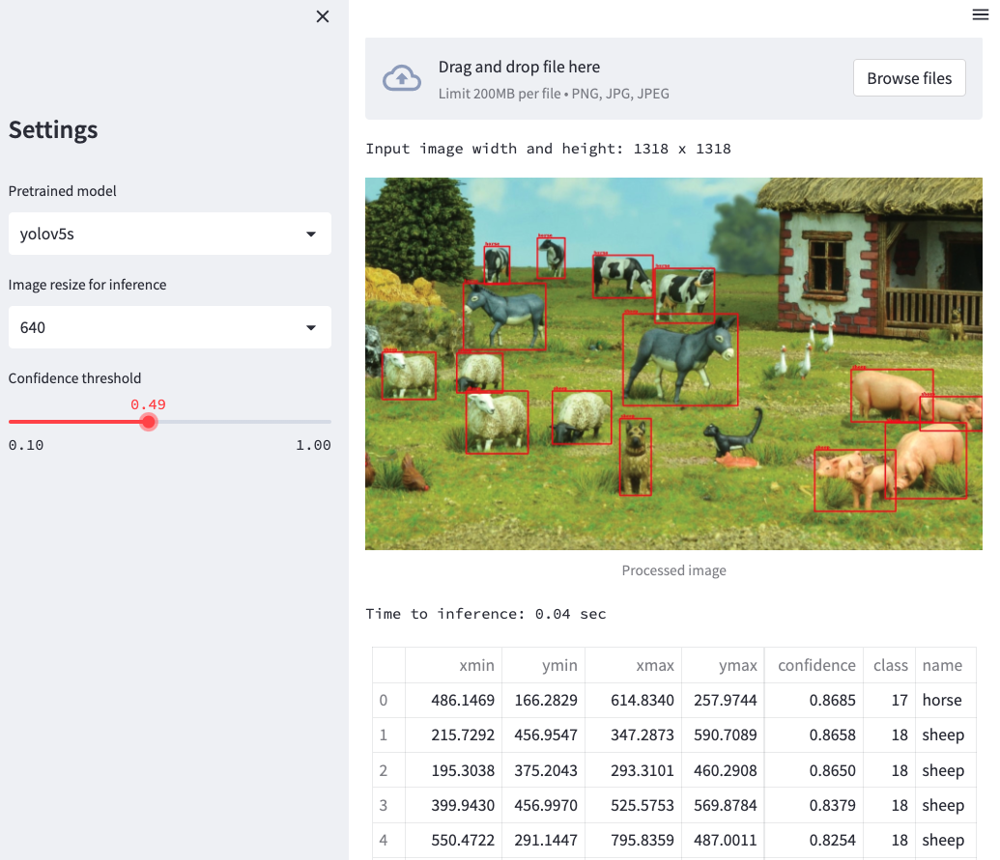

# yolov5-ui
Web ui for yolov5 using Streamlit

## Usage (Mac)
* Create and activate a venv: `python3 -m venv venv` and `source venv/bin/activate`
* Install requirements: `pip install -r requirements.txt`
* Run streamlit from `app` folder: `streamlit run app.py`

## Deploy to Huggingface space
- [spaces docs](https://huggingface.co/docs/hub/spaces)

## References
- [Yolov5 docs for torchhub](https://github.com/ultralytics/yolov5/issues/36)
- [Yolov5 on torchhub](https://pytorch.org/hub/ultralytics_yolov5/)

## Related projects
- [deepstack-ui](https://github.com/robmarkcole/deepstack-ui) -> provided much of the inspiration
- [yolov5-flask](https://github.com/robmarkcole/yolov5-flask) -> example deploying yolov5 as a flask API serivce
- [sahi-yolox](https://huggingface.co/spaces/fcakyon/sahi-yolox)